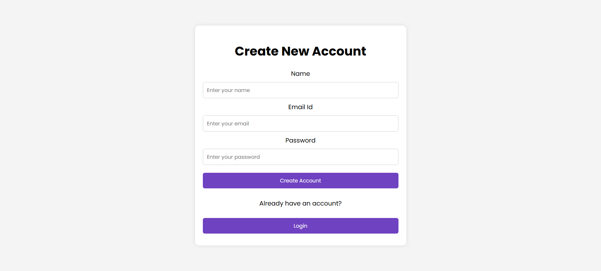

# URL Shortener

A simple URL shortener built using Node.js, Express, and REST API, following the MVC architecture for efficient URL management.

## Features

- User authentication (Admin & Regular users)
- URL shortening functionality
- Analytics for shortened URLs
- Role-based access control
- Secure password hashing using bcrypt
- JWT-based authentication
- MongoDB for data storage

## Installation

1. Clone the repository:
   ```sh
   git clone https://github.com/siddheshrm/node-url-shortner.git
   ```
2. Navigate to the project directory:
   ```sh
   cd node-url-shortner
   ```
3. Install dependencies:
   ```sh
   npm install
   ```
4. Create a `.env` file in the root directory and configure environment variables:
   ```sh
   MONGODB_URI=mongodb://127.0.0.1:27017/mongo-db-name
   SECRET_KEY=your_secret_key
   ADMIN_EMAIL=admin@gmail.com
   ```

## Scripts

- **Start the server:**

  ```sh
  npm start
  ```

  Runs the application using Nodemon for automatic restarts.

- **Make an admin user:**
  ```sh
  npm run make-admin
  ```
  Runs `makeAdmin.js` to assign admin privileges to a user in the database. Make sure to modify the script with the correct user email before running it.

## Project Structure

```
url-shortner/
│── controllers/                    # Controller functions
│── models/                         # Mongoose models
│── routes/                         # Express routes
│── views/                          # EJS templates
│── public/                         # Static assets (CSS)
│── .env                            # Environment variables
│── index.js                        # Main application entry point
│── API Documentation               # Dependencies and scripts
│── package.json                    # Dependencies and scripts
```

## Usage

- Run `npm start` to start the server.
- Open `http://localhost:3000/` to access the application.

## Screenshots

- Login Page : 
- Signup Page : 
- Regular User Dashboard : 
- Admin Dashboard : 

## About Me

You can learn more about me and my other projects on my [personal portfolio website](https://siddheshmestri.online/).
